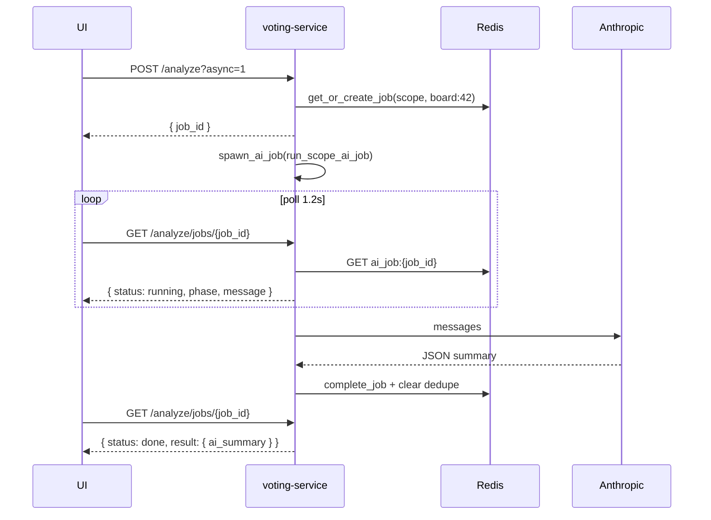

# WebSocket и AI jobs

---

## Voting WebSocket

**URL:** `wss://{domain}/api/v1/ws/{token}`  
**Source:** `services/voting_service/web_api.py`

### Handshake

1. Resolve `web:{token}` in Redis → `{chat_id, topic_id}`.
2. Send initial `session_state`.
3. Subscribe to Redis channel `session_events:{chat_id}:{topic_id|"none"}`.
4. On pub/sub message → push updated `session_state`.

### Server → client messages

```typescript
// Initial + every state change
{
  type: "session_state",
  state: WebSessionState
}

// Keepalive (every 20s idle) — Cloudflare 100s timeout workaround
{ type: "ping" }
```

### WebSessionState

```typescript
{
  task: {
    task_id, text, jira_key, story_points,
    story_points_by_track?, ai_summary,
    description, description_adf, description_html,
    index, total
  } | null,
  phase: "waiting" | "voting" | "results" | "complete",
  participants: [{ name, role, voted, value, track, track_label }],
  results: FlatResults | null,
  track_results: TrackResults | null,
  // estimation_mode, scales, tracks from session config
}
```

### Close codes

| Code | Reason |
|---|---|
| 4004 | token expired/unknown |
| 1011 | failed to load initial state |

### Client best practices

- On `session_state` — replace entire UI state (don't merge partially).
- On disconnect — fallback poll `GET /web/state/{token}`.
- Manager side uses same pub/sub via session mutations.

Frontend: `useReconnectOnVisible` re-fetches when tab becomes visible (Cloudflare idle drops).

---

## Retro WebSocket

**URL:** `wss://{domain}/api/v1/retro-ws/{token}`  
**Source:** `services/voting_service/retro_api.py`

### Messages

```typescript
{ type: "retro_state", state: RetroLiveState }
{ type: "ping" }
```

### RetroLiveState (highlights)

```typescript
{
  retro_id, title,
  phase: "lobby" | "collecting" | "voting" | "discussing" | "done",
  active_section_id, section_deadline,
  sections: [{ id, title, ... }],
  cards: [{ card_id, section_id, text, group_id, vote_count }],
  groups: [{ group_id, title, card_ids, vote_count }],
  action_items: [...],
  votes_per_person,
  my_votes: string[],
  my_votes_remaining: number,
  version: number,          // optimistic concurrency
  ai_summary?: ...         // only when phase === "done"
}
```

Redis channel: `retro_events:{retro_id}`.

Close codes: 4004 (bad token), 4503 (store unavailable), 1011.

---

## AI jobs

**Source:** `services/voting_service/ai_jobs.py`, `ai_job_runners.py`

### Kinds

| kind | resource_key | Trigger |
|---|---|---|
| `scope` | `board:{id}` | `POST /cms/scope-boards/{id}/analyze` |
| `retro` | `retro:{id}` | `POST /cms/retros/{id}/analyze` |
| `standup` | `standup:{id}` or `standup:{id}:refresh` | auto on first publish; `POST /cms/standups/{id}/analyze` |
| `session_ai_summary` | `session:{chat_id}:{task_id}[:refresh]` | `POST /app/sessions/.../ai-summary` |

### Job record (Redis `ai_job:{job_id}`)

```typescript
{
  job_id: string
  kind: "scope" | "retro" | "standup" | "session_ai_summary"
  resource_key: string
  actor: string
  status: "queued" | "running" | "done" | "error"
  phase: "queued" | "building_context" | "calling_llm" | "validating" | "saving" | "done"
  message: string          // Russian UI strings
  started_at: string
  updated_at: string
  error?: string
  result?: object          // only when done
}
```

### Public poll response

`GET …/analyze/jobs/{job_id}` → `job_public_view()`:

```typescript
{
  job_id, status, phase, message,
  started_at, updated_at,
  error?,      // when status === "error"
  result?      // when status === "done"
}
```

### Result payloads

| kind | result |
|---|---|
| scope | `{ ai_summary, board, cached?: boolean }` |
| retro | `{ ai_summary, cached?: boolean }` |
| standup | `{ ai_summary, cached?: boolean }` |
| session | `{ session, cached?: boolean }` |

### Dedupe

`get_or_create_job(kind, resource_key)`:

- If `ai_job_dedupe:{kind}:{resource_key}` points to active job → return same `job_id`, `is_new: false`.
- Stale running (> `AI_JOB_STALE_SECONDS=300`) → fail + create new.

### Async flow

```
POST …/analyze?async=1
  → get_or_create_job()
  → spawn_ai_job(asyncio.create_task)
  → return { job_id }

Client polls every 1200ms (default)
  → GET …/jobs/{job_id}
  → until status === "done" | "error" | timeout
```

Frontend: `pollAiJob<T>(fetchStatus, { intervalMs, timeoutMs, onProgress })`  
Defaults:
- interval: 1200ms
- scope timeout: 300_000ms
- default timeout: 180_000ms

On error: `throw new Error(job.error || job.message)`  
On timeout: `"Превышено время ожидания AI-генерации"`

### Sync flow

Same endpoint without `async=1` — blocks until LLM returns (fast path) or falls back to job.

### Phases (UI progress)

| phase | message (RU) |
|---|---|
| queued | В очереди |
| building_context | Собираем контекст |
| calling_llm | AI генерирует ответ |
| validating | Проверяем результат |
| saving | Сохраняем |
| done | Готово |

---

## Sequence: async scope analyze



---

## Env vars (AI)

| Variable | Default | Notes |
|---|---|---|
| `ANTHROPIC_API_KEY` | — | required |
| `ANTHROPIC_MODEL` | claude-haiku-4-5-20251001 | |
| `ANTHROPIC_TIMEOUT_SECONDS` | 20 | task summary |
| `SCOPE_AI_TIMEOUT_SECONDS` | 60 | scope |
| `SCOPE_AI_MAX_OUTPUT_TOKENS` | 3600 | |
| `SCOPE_AI_MAX_CONTEXT_CHARS` | 5600 | |
| `STANDUP_AI_RATE_MAX` | 20 | standup analyze per actor/hour |
| `STANDUP_AI_RATE_WINDOW_SECONDS` | 3600 | standup rate window |
| `TELEGRAM_BOT_TOKEN` | — | standup digest notify |
| `TELEGRAM_CHAT_ID` | — | standup digest notify |
| `AI_JOB_TTL_SECONDS` | 3600 | Redis TTL |
| `AI_JOB_STALE_SECONDS` | 300 | stale detection |

Rate limits: see [../development/GUIDE.md](../development/GUIDE.md).
