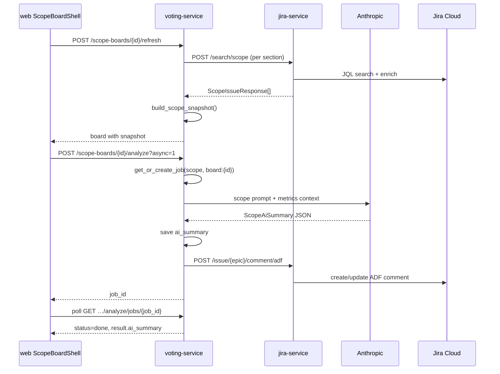

# Scope board — контракты и pipeline

Domain: `voting-service/app/domain/scope_board.py`  
HTTP: `voting-service/services/voting_service/cms_api.py`  
Frontend types: `web/src/features/cms/api/cmsClient.ts`

---

## Report types

```python
ScopeReportType = "monthly" | "release"

RELEASE_SCOPE_TEAM_SLUGS = {"igaming-ios", "igaming-android"}
```

`infer_scope_report_type(team_slug)` → `"release"` для mobile slugs, иначе `"monthly"`.

Release boards: один блок «Текущий релиз» + `release_context` в snapshot.

---

## Board config (create / update)

```typescript
// cms_api.py Pydantic mirrors in cmsClient.ts
{
  name: string
  month: string              // YYYY-MM
  capacity_sp: number
  capacity_sp_dev?: number   // when workload_mode = sp_dev_test
  capacity_sp_test?: number
  workload_mode: "sp" | "sp_dev_test"
  scope_sections: [{
    id?: string
    name: string
    jql: string
    kind: "planned" | "unplanned"
    order: number            // 0..99
  }]
  plan_jql?: string          // legacy flat (still supported)
  unplan_jql?: string
  todo_jql?: string
  test_jql?: string
  release_queries?: [{ jql, label?, comment? }]
  plan_epic_key?: string     // Jira key for AI export, e.g. FLEX-123
  team_id?: number           // create only
}
```

---

## Refresh pipeline

`POST /cms/scope-boards/{id}/refresh`

```text
1. Auth: cms.planner.view + team scope
2. Rate limit: actor (30/h) + board (12/h)
3. Fetch scope sections ──parallel──► jira-service POST /search/scope
4. Fetch todo_jql, test_jql (enrich_changelog=true)
5. If report_type=release: fetch release JQLs + version metadata
6. Failure policy:
   - all JQL failed → 503, snapshot unchanged
   - partial failure + had previous snapshot → 503, snapshot unchanged
7. compute_scope_metrics_from_sections()
8. build_scope_snapshot() + delta/events
9. merge_priority_queue() — preserve manual order/comments
10. compute_scope_flow_pace() — AI пульс спринта (Plan/Unplan, team-gated)
11. copy manual_questions, top_items, todo_items, report_comments from prev
12. store.save_scope_board_snapshot()
13. audit cms.scope_board.refresh
```

**Best practice:** не менять snapshot вручную в Postgres — только через refresh или PATCH endpoints.

---

## Snapshot shape

```typescript
interface ScopeBoardSnapshot {
  sections: ScopeSection[]       // planned/unplanned + issues
  plan_issues: ScopeBoardIssue[] // legacy flat derived
  unplan_issues: ScopeBoardIssue[]
  metrics: ScopeBoardMetrics
  report: ScopeReport
  jira_role_fields_configured: { front, back, qa: boolean }
  refreshed_at: string             // ISO8601
  delta?: ScopeRefreshDelta
  events?: ScopeRefreshEvent[]
  refresh_log?: [...]              // last 15 refreshes
  manual_questions?: [...]
  resolved_questions?: [...]
  top_items?: [...]
  todo_items?: [...]
  report_comments?: Record<issueKey, string>
  priority_queues?: {
    todo: ScopePriorityQueue
    test: ScopePriorityQueue
  }
  release_context?: ScopeReleaseContext  // release boards only
  jira_fetch_warnings?: string[]
  flow_pace?: ScopeFlowPaceSnapshot   // see «AI пульс спринта» below
}
```

### Metrics (`metrics`)

Ключевые поля:

| Field | Type | Meaning |
|---|---|---|
| `workload_mode` | `sp` \| `sp_dev_test` | режим ёмкости |
| `capacity_sp[_dev\|_test]` | number | заданная ёмкость |
| `plan_sp`, `unplan_sp` | number | SP в plan/unplan |
| `buffer_sp` | number | запас |
| `intake_status` | `ok` \| `warning` \| `stop` | можно ли брать новый scope |
| `plan_by_role` | dict | active horizon workload |
| `plan_by_role_sprint` | dict | sprint horizon workload |
| `scope_creep_count` | number | |
| `unestimated_tasks` | array | force warning |

Intake rules (`sp` mode):
- buffer ≤ 0 → `stop`
- buffer ≤ 20% capacity → `warning`
- unestimated tasks → at least `warning`

### Issue in snapshot (`ScopeBoardIssue`)

Нормализация: `normalize_scope_issue()` из jira-service `ScopeIssueResponse`.

Frontend mirror: `cmsClient.ts` lines ~374–443 — key, summary, story_points, story_points_dev/test, status, role_contributors, plan_status, sprints, **start_date**, **resolution_date**, changelog segments (for flow pace), etc.

---

## AI пульс спринта (`flow_pace`)

Domain: `voting-service/app/domain/scope_flow_pace.py`  
UI block key: `flowPace` (layout order, after `planInsights`)  
Enabled teams: `igaming-rip` (`FLOW_PACE_TEAM_SLUGS`)

Computed on refresh from Plan/Unplan sections only (active + closed issues). Requires Jira changelog enrichment (`enrich_changelog=true` on scope search).

### Board record fields

```typescript
{
  flow_pace_chart_order?: string[]   // persisted DnD order of donut charts
}
```

### Snapshot shape (`flow_pace`)

```typescript
interface ScopeFlowPaceSnapshot {
  enabled: boolean
  pace_status: "ok" | "attention" | "critical"
  chart_order?: string[]
  charts: {
    donuts: ScopeFlowPaceChart[]
  }
  alerts: ScopeFlowAlert[]           // flat list (also embedded in active_signals chart)
  summary: {
    active_count: number
    closed_count: number
    alert_count: number
    high_alert_count: number
  }
}

interface ScopeFlowPaceChart {
  id: "done_mix" | "throughput" | "cycle_time" | "phase_time" | "qa_iterations" | "active_signals"
  title: string
  subtitle: string
  center_value: string
  center_label: string
  segments: { key, label, value, color }[]
  methodology?: string               // shown in detail panel
  detail_segments?: [{
    key: string
    label: string
    items: [{
      issue_key: string
      issue_url?: string
      summary?: string
      metric_label?: string          // e.g. "Всего" for phase_time
      metric_value?: string          // e.g. "438.2 дн." — total days in statuses
      detail?: string                // chronological timeline for phase_time
      alert?: ScopeFlowAlert         // active_signals only
      flow_bucket?: string           // other charts only (not phase_time detail)
    }]
  }]
}
```

Chart order is normalized server-side to the six known IDs; unknown IDs are dropped, missing IDs appended at default positions.

### Chart: «Время в статусах» (`phase_time`)

Источник: `status_durations` из Jira changelog (`compute_issue_flow_timeline`). Только закрытые задачи.

- **Donut** — топ-8 статусов по суммарным дням; остальные в «Ещё N статусов»
- **Центр** — число уникальных статусов
- **Детализация** — один сегмент `issues`: закрытые задачи **от самой длинной к короткой** (`metric_value` = сумма дней в **рабочих** статусах); внутри карточки — хронологический timeline (`detail`). **Done/Готово/Closed не показываются** — задача уже закрыта; интервал changelog для закрытых обрезается по `resolution_date`, не по «сегодня».

Пример `detail_segments` для одной задачи:

```json
{
  "key": "issues",
  "label": "Задачи · 84",
  "items": [{
    "issue_key": "FLEX-123",
    "summary": "…",
    "metric_label": "Всего",
    "metric_value": "438.2 дн.",
    "detail": "Backlog 120.0 дн. · К выполнению 98.0 дн. · В работе 34.0 дн. · …"
  }]
}
```

Справочная группа (`status_flow_bucket_map`) — из `status_flow_buckets.py`, используется в других графиках (`qa_iterations`, сигналы), **не** в детализации `phase_time`. Поле `status_catalog` удалено.

### Chart order API

```
PATCH /cms/scope-boards/{id}/flow-pace-chart-order
Body: { "chart_order": ["done_mix", "throughput", ...] }
Permission: cms.planner.view + team scope
```

On read, `cms_store` merges `flow_pace_chart_order` with snapshot donuts via `apply_flow_pace_chart_order()`.

### UI behavior

- Section «AI пульс спринта»: collapsible block with draggable donut grid (`@dnd-kit`).
- Click donut → full-width detail panel below grid (methodology + cards).
- **`phase_time`**: flat task list (no status groups, no share table); each card shows issue key, summary, total days, chronological timeline.
- Other donuts: grouped `detail_segments` with per-segment task cards.
- `active_signals` reuses signal card styling (High/Medium/Low groups).

---

## Priority queues

Kinds: `"todo"`, `"test"`.

```typescript
{
  order: string[]           // issue keys, manual DnD
  issues: ScopeBoardIssue[]
  history: [{
    at, kind: "reorder"|"comment"|"refresh"|"appeared",
    actor?, issue_key?, ...
  }]
  filter_seen_at: Record<key, iso>
}
```

Reorder: `POST /queues/{kind}/reorder` body `{order: string[]}`.

---

## Scope AI

### Analyze

```
POST /cms/scope-boards/{id}/analyze?async=1
→ sync: { ai_summary, board, cached? }
→ async: { job_id, is_new? }
```

Poll: `GET …/analyze/jobs/{job_id}` → `AiJobResponse`.

### Summary schema (LLM output)

```typescript
interface ScopeAiSummary {
  health: "green" | "yellow" | "red"
  summary: string
  whats_good: string[]
  whats_bad: string[]
  whats_critical: string[]
  buffer_status: "ok" | "tight" | "critical" | "overfilled" | "unknown"
  blockers: [{ title, severity, detail, issue_keys }]
  recommendations: [{ text, impact }]
  focus_now: string[]
  // + report_assessment, role_workload_assessment, queue_insights, ...
  jira_export?: {
    status: "ok" | "error" | "pending"
    error?: string
    comment_id?: string
    summary_hash?: string
  }
}
```

Validation: `scope_ai_llm.py`. Stored in `cms_scope_boards.ai_summary`.

### Cache

`find_cached_scope_summary(board, snapshot.refreshed_at)` — если тот же snapshot уже анализировали, LLM skip (`cached: true`). Jira export всё равно может обновиться.

### Jira export

Если `plan_epic_key` задан → ADF comment на epic после analyze.

Module: `scope_ai_jira_export.py`. Skip if summary hash unchanged.

Frontend badge: `scopeAiJiraExport.tsx`.

---

## Layout

`PATCH /cms/scope-boards/{id}/layout`

```json
{ "layout_order": ["topItems", "capacity", "roleWorkload", "planInsights", "flowPace", "aiSummary", ...] }
```

Block keys: `topItems`, `capacity`, `roleWorkload`, `planInsights`, `flowPace`, `aiSummary`, `report`, `priorityQueues`, `activity`, `snapshotSections`, `settings` — defined in `cms_api.py` (`SCOPE_LAYOUT_BLOCK_KEYS`) and mirrored in `web/src/features/cms/scope/scopeLayoutOrder.ts`.

---

## Sequence: refresh → analyze → Jira export



---

## Tests

| Repo | File | Covers |
|---|---|---|
| voting-service | `tests/test_scope_ai_*.py` | AI prompt, export |
| voting-service | `tests/test_infer_scope_report_type.py` | report types |
| voting-service | `tests/test_cms_scope_fetch.py` | refresh fetch |
| voting-service | `tests/test_scope_flow_pace.py` | flow pace metrics, alerts, chart order, phase_time task detail |
| voting-service | `tests/test_scope_layout.py` | layout block keys incl. flowPace |
| jira-service | `tests/test_scope_board.py` | enrichment shape |
| jira-service | `tests/test_jira_flow_timeline.py` | status_durations, status_segments, status_flow_bucket_map |
| jira-service | `tests/test_status_flow_buckets.py` | Jira status → dev/test/pause/todo/done |
| jira-service | `tests/test_scope_issue_start_date.py` | start_date field for cycle metrics |
