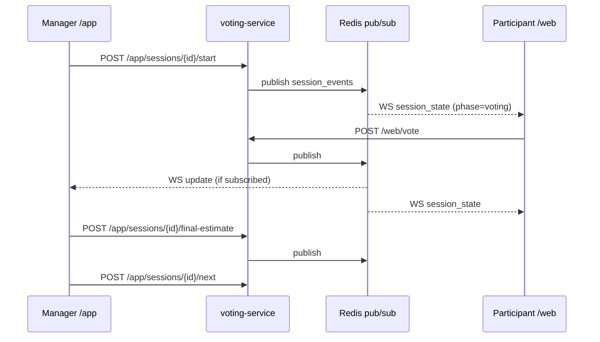

# Planning Poker — Sessions & Voting

Контракты live-сессий planning poker.

**Backend:** `app_api.py` (manager), `web_api.py` (participant)  
**Domain:** `app/domain/` models, `redis_repository.py`  
**Frontend:** `src/features/manage/`, `src/features/session/`

---

## Session identity

| Field | Type | Notes |
|---|---|---|
| `chat_id` | int | session id (legacy Telegram naming) |
| `topic_id` | int \| null | optional sub-session |
| `session_key` | string | `{chat_id}:{topic_id\|"none"}` |

Redis key: `session:{chat_id}:{topic_id|"none"}`.

Postgres mirror: `cms_sessions` with `raw JSONB` canonical state.

---

## Estimation modes

| Mode | Behavior |
|---|---|
| `flat` | single SP scale for all |
| `split` | per-track SP (backend/front/qa) with separate scales |

Configured at session create: `{ estimation_mode: "flat" | "split" }`.

Cards: 1, 2, 3, 5, 8, 13, 21.

---

## Session phases (participant view)

```text
waiting → voting → results → (next task) → … → complete
```

Manager controls transitions via `/app/sessions/{chat_id}/start|next|skip|final-estimate|finish`.

---

## Task model

```typescript
{
  task_id: string
  text: string              // summary, 1..500
  jira_key?: string
  url?: string
  story_points?: number
  story_points_by_track?: Record<string, number>
  source: "manual" | "jira"
  ai_summary?: AiTaskSummary
  bucket: "queue" | "active" | "completed"
}
```

Optimistic concurrency: `expected_version` (= `tasks_version`) on mutations. Conflict → **409**.

---

## Voting flow (sequence)



---

## Web invite

Manager: `POST /app/sessions/{chat_id}/invite` → `{ token, url: "/s/{token}" }`.

Participant:
1. `POST /web/join` — email + role (validated domain)
2. `GET /web/state/{token}` or WS for live updates
3. `POST /web/vote`

Token TTL: **8 hours**.

---

## Jira import

1. Manager: `POST /app/sessions/{chat_id}/tasks/jira-preview` `{ jql }`
2. voting-service → jira-service `POST /api/v1/parse`
3. Manager selects keys: `POST …/jira-import` `{ issue_keys: [] }`

Tasks appended with `source: "jira"`.

---

## AI task summary

```
POST /app/sessions/{chat_id}/ai-summary?async=1&refresh=1
Body: { task_id }
```

Flow:
1. Fetch Jira context via jira-service `/issue/{key}/context`
2. Claude generates summary
3. Optional ADF comment back to Jira
4. Stored on task as `ai_summary`

Poll: `GET …/ai-summary/jobs/{job_id}`.

Rate limit: 20/hour per actor.

---

## Jira SP writeback

```
POST /app/sessions/{chat_id}/jira-story-points/sync
Body: { skip_errors?: bool }   // default true
```

**Auth:** CMS cookie + `app.sessions.manage` + **team scope** (`_require_manager_session`).

Writes final estimates from the last finished batch to Jira via jira-service. Supports split fields per role.

| Response | When |
|---|---|
| 200 | `{ updated, failed, skipped }` |
| 400 | no completed batch |
| 404 | session not found **or** foreign team (no existence leak) |

---

## Session reports

| Format | Path |
|---|---|
| JSON | `GET /app/sessions/{chat_id}/summary` |
| CSV | `GET …/summary.csv` |
| Markdown | `GET …/summary.md` |

Finished session UI: `/cms/sessions/{id}/report`.

---

## Telegram alert

Sent when session **newly** completes (auto-finish, explicit finish, CMS close).

Requires `TELEGRAM_BOT_TOKEN`, `TELEGRAM_CHAT_ID`, `WEB_UI_URL` in voting-service runtime env.

Module: `session_finish_notify.py`.

---

## Tests

| File | Covers |
|---|---|
| `test_web_api.py` | join, vote, state |
| `test_web_usecases.py` | voting logic |
| `test_estimation.py` | SP calculation |
| `test_ai_summary_*.py` | AI prompt + Jira export |
| `test_close_session.py` | finish flow |
| `test_app_jira_sp_rbac.py` | Jira SP sync team scope |
| `test_telegram_session_alert.py` | alerts |

---

## Best practices

- Always handle **409** on task mutations (concurrent manager + CMS edits).
- Don't store session state in frontend beyond current render — refetch on reconnect.
- Jira import preview before import — empty JQL with `JIRA_DEMO_FALLBACK=false` returns nothing, not demo data.

See also: [API.md](./API.md), [REALTIME-AI.md](./REALTIME-AI.md).
